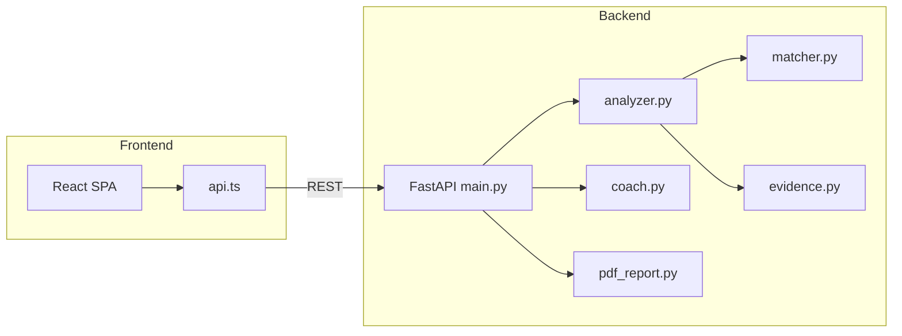

# ResumeIQ

**Evidence-based resume intelligence platform** — ATS scoring, skill verification with quoted evidence, recruiter feedback, interview prep, and a rule-based career coach. Built as a full-stack portfolio project with a production-quality UI and deterministic backend (no LLM hallucinations).

[](.github/workflows/ci.yml)
[](backend/)
[](frontend/)
[](LICENSE)

---

## Why this project exists

Most resume tools either oversell "AI" or give vague scores with no proof. ResumeIQ takes the opposite approach:

- **Deterministic scoring** — same resume always yields the same result
- **Evidence-backed skills** — every matched skill includes a quoted sentence from the resume
- **Recruiter-style feedback** — honest gaps, not generic praise
- **Demo mode** — one-click sample analysis for presentations and interviews

---

## Live demo

> **Deploy tip:** Host the frontend on Vercel/Netlify and backend on Render/Railway. Set `VITE_API_URL` to your backend URL and add your frontend origin to `CORS_ORIGINS`.

**Try locally in 60 seconds:**

```bash
docker compose up --build
```

Then open **http://localhost:5173**, toggle **Demo Mode**, and click **Run Demo Analysis**.

---

## Features

| Feature | Description |
|---------|-------------|
| PDF resume upload | Drag-and-drop, 10 MB max, text-based PDFs |
| Role-targeted ATS score | 5 roles with 50+ keywords each |
| Score breakdown | Keyword, project, experience, education, formatting |
| Skill evidence table | Quoted sentences with strength signals |
| Recruiter feedback | Rejection-style insights recruiters actually use |
| Interview readiness | Beginner / Intermediate / Ready + match % |
| Interview questions | Per missing skill |
| PDF report export | Executive summary download |
| Career Coach | Context-aware, rule-based Q&A (not generative AI) |
| Demo mode | Stable sample output — no upload required |

---

## Tech stack

| Layer | Technologies |
|-------|--------------|
| **Frontend** | React 19, TypeScript, Vite 8, Framer Motion, Axios |
| **Backend** | FastAPI, Pydantic v2, PyPDF2, ReportLab |
| **Testing** | pytest, FastAPI TestClient |
| **DevOps** | Docker, GitHub Actions CI |

---

## Architecture



**Backend modules** (`backend/resumeiq/`):

- `analyzer.py` — orchestrates ATS scoring
- `matcher.py` — word-boundary keyword matching with aliases
- `evidence.py` — extracts quoted skill evidence (anti-hallucination gate)
- `recruiter.py` — recruiter-style rejection feedback
- `interview.py` — readiness level + question generation
- `coach.py` — rule-based career coach responses

---

## Quick start

### Prerequisites

- Python 3.11+
- Node.js 20+
- npm

### 1. Backend

```bash
cd backend
python -m venv venv
# Windows
venv\Scripts\activate
# macOS/Linux
source venv/bin/activate

pip install -r requirements.txt
uvicorn main:app --reload --port 8000
```

API docs: **http://localhost:8000/docs**

### 2. Frontend

```bash
cd frontend
npm install
npm run dev
```

App: **http://localhost:5173**

Optional: copy `frontend/.env.example` → `frontend/.env` and set `VITE_API_URL`.

### 3. Docker (both services)

```bash
docker compose up --build
```

---

## API reference

| Method | Endpoint | Description |
|--------|----------|-------------|
| `GET` | `/health` | Health check + version |
| `GET` | `/roles` | Supported target roles |
| `GET` | `/demo` | Sample analysis (no upload) |
| `POST` | `/upload-resume` | PDF upload → ATS analysis |
| `POST` | `/download-report` | PDF upload → executive report |
| `POST` | `/ai-coach` | Career coach Q&A |

---

## Testing

```bash
cd backend
pytest -v
```

CI runs on every push/PR: backend pytest + frontend lint + build.

---

## Project structure

```
ResumeIQ/
├── backend/
│   ├── main.py              # FastAPI entry point
│   ├── resumeiq/            # Core analysis engine
│   ├── test_smoke.py        # Unit tests (matcher, evidence, coach)
│   ├── test_api.py          # API integration tests
│   └── requirements.txt
├── frontend/
│   ├── src/
│   │   ├── components/      # UI components
│   │   ├── services/api.ts  # API client
│   │   └── types/           # TypeScript types
│   └── package.json
├── .github/workflows/ci.yml
├── docker-compose.yml
└── README.md
```

---

## Environment variables

| Variable | Where | Default | Description |
|----------|-------|---------|-------------|
| `VITE_API_URL` | frontend | `http://localhost:8000` | Backend base URL |
| `CORS_ORIGINS` | backend | `*` | Comma-separated allowed origins |

---

## Design philosophy

ResumeIQ intentionally uses **rule-based intelligence** instead of generative AI for scoring. This means:

- Zero hallucinated skills
- Fully explainable scores
- Consistent demo output for interviews
- No API key required to run

The Career Coach is also rule-based — it uses your analysis context to give structured guidance, not invented facts.

---

## License

MIT — see [LICENSE](LICENSE).

---

## Author

Built as a portfolio project demonstrating full-stack engineering, product thinking, and recruiter-aware UX.
